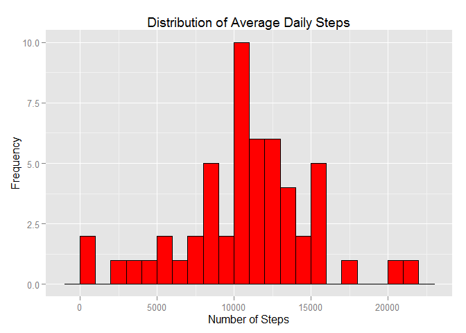
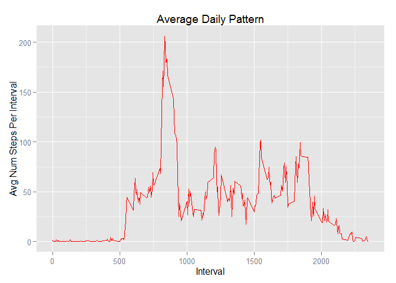
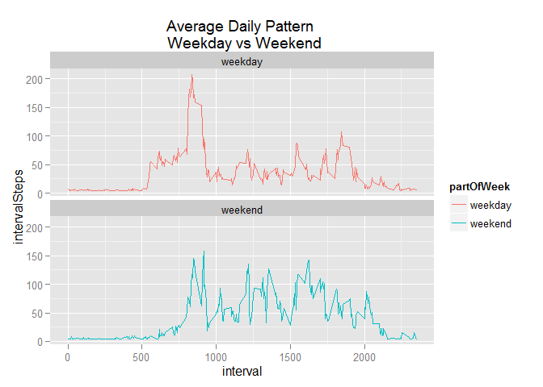

# Reproducible Research: Peer Assessment 1
Tony Smaldone  
Friday, July 17, 2015  


This project will explore the personal daily activity in terms of steps taken, from an individual wearing a personal activity monitoring device. The device records data at 5 minute intervals throughout the day. The data collected were from two months, October through November, 2012, inclusive and is contained in the activity.csv file.

### Initialization, Loading, Processing The Data

Load the two R packages, `dplyr` and `gglot2`, that will be used in the analysis of the data. The `dplyr` package, developed by Hadley Wickham, of R Studio, provides more covenient and optimized access to data frames in addition to providing ease of manipulation. The `ggplot2` package is one of the three plotting systems in R (base, lattice and ggplot2) and, to some degree, implements some of the key features of the base and lattice plotting systems.


```r
library(dplyr)
```

```
## 
## Attaching package: 'dplyr'
## 
## The following objects are masked from 'package:stats':
## 
##     filter, lag
## 
## The following objects are masked from 'package:base':
## 
##     intersect, setdiff, setequal, union
```

```r
library(ggplot2)
```
Set the working directory and read in the activity data.


```r
setwd("~/Coursera/Reproducible Research")
activityData <- read.csv("activity.csv")
```

Taking a quick look at the data frame shows that there are 17568 observations with three variables


```r
str(activityData)
```

```
## 'data.frame':	17568 obs. of  3 variables:
##  $ steps   : int  NA NA NA NA NA NA NA NA NA NA ...
##  $ date    : Factor w/ 61 levels "2012-10-01","2012-10-02",..: 1 1 1 1 1 1 1 1 1 1 ...
##  $ interval: int  0 5 10 15 20 25 30 35 40 45 ...
```

The meaning of the variables in the data set are:

* steps: Number of steps taken in a 5-minute interval; missing values are recorded as `NA`

* date: The date on which the measurement was taken; recorded in YYYY-MM-DD format

* interval: The identifier for the interval in which the measurement was taken; note the identifier is numbered sequentially in increments of 5, **with each identifier corresponding to time of day**. For example, identifier 2000 corresponds to 8:00 PM. 

Given that the interval number corresponds to time of day, there are 288 entries per day (12 5-minute intervals per hour, 24 hours per day: $(12)(24) = 288$. Given that the data covers the months of October, which has 31 days, and November (which has 30 days), the expected number of data points (observations) is: $(288)(61) = 17568$, which corresponds to the number of observations in the activity data set. The 288 intervals per day will be numbered 0 through 2355, corresponding to midnight through 11:55 PM.

Note: there are `NA` entries in `steps`, which will be removed or replaced as indicated in the subsequent analysis.

### Mean Total Number Of Steps Per Day

This part of the overall analysis effort will focus on assessing the mean number of steps per day over the course of the two month timeframe. In particular:

1. Calculate the total number of steps taken per day

2. Make a histogram of the toal number of steps taken each day

3. Calculate and report the mean and median of the toal number of steps taken per day

**Note: For this analysis, the missing values in the data set will be ignored (i.e., removed).**

Using the data frame manipulation methods from `dplyr` remove the `NA` entries, organize by date (day) and finally record the total number of steps per date (day). The results will be placed in the `stepsPerDay` data frame.


```r
stepsPerDay <- activityData %>% filter(!is.na(steps)) %>% group_by(date) %>% summarize(totalSteps = sum(steps))
```

Looking at the resulting `stepsPerDay` data frame there are 53 oobservations (rows) with each row containing the average number of steps for that given day. The fact that there are only 53 observations, versus the expected 61 (the number of days in the two months) is due to there being missing data (`NA`s) for some of the days.


```r
str(stepsPerDay)
```

```
## Classes 'tbl_df', 'tbl' and 'data.frame':	53 obs. of  2 variables:
##  $ date      : Factor w/ 61 levels "2012-10-01","2012-10-02",..: 2 3 4 5 6 7 9 10 11 12 ...
##  $ totalSteps: int  126 11352 12116 13294 15420 11015 12811 9900 10304 17382 ...
##  - attr(*, "drop")= logi TRUE
```

```r
head(stepsPerDay)
```

```
## Source: local data frame [6 x 2]
## 
##         date totalSteps
## 1 2012-10-02        126
## 2 2012-10-03      11352
## 3 2012-10-04      12116
## 4 2012-10-05      13294
## 5 2012-10-06      15420
## 6 2012-10-07      11015
```

To visualize the results, create a histogram showing the frequency of a range of number of steps which occurred in a given day. The range selected was 1000, which translates to the bin size in the histogram (1000 was picked after assessing the data itself and resulting histograms). Note, the data reflects the occurrances of the total number of steps recorded in one day's time over two month period, it does not break down the data by specific day.

`ggplot` was used to create the histogram with the initial plot built then various elements were added to it.


```r
h<-ggplot(stepsPerDay,aes(x=totalSteps))
h<-h + geom_histogram(color="black",fill="red",binwidth=1000)
h<-h + labs(title = "Distribution of Average Daily Steps", x = "Number of Steps", y = "Frequency")
print(h)
```

 

The distribution of average daily steps shows that the most frequent average was between 10000 and 11000 steps per day. 

And, lastly, the mean and median of the number of steps per day over the entire two month period are computed.


```r
mean(stepsPerDay$totalSteps)
```

```
## [1] 10766.19
```

```r
median(stepsPerDay$totalSteps)
```

```
## [1] 10765
```

The mean is 10766.19 and the median is 10765. The mean is consistent with the distribution results of the histogram. The median and mean are nearly the same, thus indicating no significant outliers that would affect the mean. 

### Average Daily Activity Pattern

This part of the overall analysis effort will focus on assessing the average number of steps for each interval within a 24-hour period across all days within the two month period. In particular:

1. Make a time series plot (i.e., `type = "1"`) of the 5-minute interval (x-axis) and the average number of steps taken, averaged across all days (y-axis)

2. Which 5-minute interval, on average across all the days in the data set, contains the maximum number of steps?

Using the data frame manipulation methods from `dplyr` remove the `NA` entries, organize by interval and finally record the mean number of steps per interval across all the days. The results will be placed in the `stepsPerInterval` data frame.


```r
stepsPerInterval <- activityData %>% filter(!is.na(steps)) %>% group_by(interval) %>% summarize(intervalSteps = mean(steps))
```

Looking at the resulting `stepsPerInterval` data frame for each 5-minute interval there is a corresponding average across all days. The interval numbers range from 0 to 2355, corresponding to the times of a 24-hour day.


```r
str(stepsPerInterval)
```

```
## Classes 'tbl_df', 'tbl' and 'data.frame':	288 obs. of  2 variables:
##  $ interval     : int  0 5 10 15 20 25 30 35 40 45 ...
##  $ intervalSteps: num  1.717 0.3396 0.1321 0.1509 0.0755 ...
##  - attr(*, "drop")= logi TRUE
```

```r
head(stepsPerInterval)
```

```
## Source: local data frame [6 x 2]
## 
##   interval intervalSteps
## 1        0     1.7169811
## 2        5     0.3396226
## 3       10     0.1320755
## 4       15     0.1509434
## 5       20     0.0754717
## 6       25     2.0943396
```

```r
tail(stepsPerInterval)
```

```
## Source: local data frame [6 x 2]
## 
##     interval intervalSteps
## 283     2330     2.6037736
## 284     2335     4.6981132
## 285     2340     3.3018868
## 286     2345     0.6415094
## 287     2350     0.2264151
## 288     2355     1.0754717
```

For each interval, 0 through 2355 (again, corresponding to the time during the day) the average is reported for that interval from each day within the two month period.

To visualize the results, create a plot showing the average number of steps per interval across all days. 

`ggplot` was used to create the plot with the initial plot built then various elements were added to it.


```r
h<-ggplot(stepsPerInterval,aes(x=interval, y=intervalSteps))
h <- h + geom_line(color="red")
h<-h + labs(title = "Average Daily Pattern", x = "Interval", y = "Avg Num Steps Per Interval")
print(h)
```

 

The graph shows that there is little activity between the intervals 0 through 500 (corresponding to midnight and 5:00 AM), which can be expected for that is normally sleep time. Likewise, late in the evening there is relatively little activity. The major source of activity is during the day-time hours.

To see which 5-minute interval had the maximum number of steps, on average, the `arrange()` function was used to list the `intervalSteps` results in descending order:


```r
arrange(stepsPerInterval,desc(intervalSteps))
```

```
## Source: local data frame [288 x 2]
## 
##    interval intervalSteps
## 1       835      206.1698
## 2       840      195.9245
## 3       850      183.3962
## 4       845      179.5660
## 5       830      177.3019
## 6       820      171.1509
## 7       855      167.0189
## 8       815      157.5283
## 9       825      155.3962
## 10      900      143.4528
## ..      ...           ...
```

Interval 835 had the maximum number of steps (206.1698). This corresponds to 8:35 AM and corresponds to what was seen in the graph. The time might correspond to doing early morning exercise, walking to work, etc.

### Inputting Missing Values

It was observed above that there appears to be missing data (`NA`s). The consequence of such might be that bias would be introduced into some of the calculations and/or summaries of the data. The specific objectives of this section are:

1. Calculate and report the total number of missing values in the dataset (i.e., the total number of rows with `NA`s

2. Devise a strategy for filling in all of the missing values in the data set. The strategy does not need to be sophisticated. For example, the mean/median for that day, or the mean for that 5-minute interval could be used (or some other technique)

3. Create a new data set that is equal to the original data set but with the missing data filled in

4. Make a histogram of the total number of steps taken each day and calculate and report the mean and median total number of steps taken per day. Do these values differ from the estimates from the first part of this analysis? What is the impact of imputing missing data on the estimates of the total daily number of steps?

To see if there are any `NA`s in the interval data:


```r
dim(filter(activityData,is.na(interval)))
```

```
## [1] 0 3
```

The fact that there are zero rows implies that there were no `NA`s in the interval data. To see if there are any `NA`s in the interval data:


```r
dim(filter(activityData,is.na(steps)))
```

```
## [1] 2304    3
```

The number of rows of 2304 indicates that there were 2304 intervals that had missing data (`NA`).

The strategy which will be used is to replace each missing data interval with the **overall* 5-minute average (i.e., the average of the average 5-minute interval data). To accomplish this, create a new data frame, `fullData`, which will, via the `mutate()` function within `dplyr, to replace all missing data with the average of the average 5-minute interval data (recall that the `stepsPerInterval` data frame has the average 5-minute interval data).


```r
fullData <- activityData %>% mutate(steps=replace(steps,is.na(steps),mean(stepsPerInterval$intervalSteps)))
```

Verify that there are no missing values (`NA`s):


```r
dim(filter(fullData,is.na(steps))) + dim(filter(fullData,is.na(interval)))
```

```
## [1] 0 6
```

The zero for the number of rows confirms that there is no longer any missing data.

Repeat the process used in the **Mean Total Number Of Steps Per Day** section above to compute the number of steps per day and create the corresponding histogram. The only difference will be that the data used will now have all the missing values filled in.


```r
newStepsPerDay <- fullData %>% group_by(date) %>% summarize(totalSteps = sum(steps))
```

Create the histogram as per above:


```r
h<-ggplot(newStepsPerDay,aes(x=totalSteps))
h<-h + geom_histogram(color="black",fill="red",binwidth=1000)
h<-h + labs(title = "Distribution of Average Daily Steps", x = "Number of Steps", y = "Frequency")
print(h)
```

 

The overall distribution between the full data set and the original with missing values removed is the same. However, the "middle" has a higher frequency count. This was to be expected given that the missing data values were replaced with the average. 

And, lastly, the mean and median of the number of steps per day over the entire two month period:


```r
mean(newStepsPerDay$totalSteps)
```

```
## [1] 10766.19
```

```r
median(newStepsPerDay$totalSteps)
```

```
## [1] 10766.19
```

The mean was exactly the same between the two data sets. This makes sense. Given that $\bar{x} = \frac{\sum_{i=1}^{N} x_{i}}{N}$, then with $M$ average values added, the new mean becomes $\frac{\sum_{i=1}^{N} x_{i} + M\bar{x}}{N + M}$. With some simple algebraic manipulation this simplifies to $$\frac{(N + M)\frac{\sum_{i=1}^{N} x_{i}}{N}}{N+M}$$ which is nothing more than $\bar{x}$. So, the mean doesn't change.

The median value, however, did change. It now matches the mean. This is not surprising in that since the mean and the median were so close for the data set with the missing values, the addition of $M$ average values would place them in the middle of the data, such that when the new median value is computed, it is indeed the mean.

From the analysis of the mean and median, it can be concluded that for this particular situation, there was very little impact of imputing missig data on the estimates of the total daily number of steps.


### Activity Analysis Between Weekdays and Weekends

One intuitive assumption would be that there would be differences in activity between weekdays and weekdays. The questions then are is this true and, if so, which is greater. To help answer these questions, it would be desireable to, at a minimum, visually compare the weekday data against the weekend data. The specific objectives of this section are:

1. Create a new factor variable in the data set with two levels, "weekday" and "weekend" indicating whether a given date is a weekday or weekend day

2. Make a panel plot containing a time series plot (i.e., `type = "1"`) of the 5-minute interval (x-axis) and the average number of steps taken, averaged across all weekday days or weekend days (y-axis)

*Note: for this analysis the data set with the missing data filled in per the above section will be used (i.e., `fullData`).*

First it will be necessary to make sure that the `date` within the data frame is of class `date`. This is so that when the `weekday()` function is used it can separate dates that are weekdays and those which are weekends.


```r
fullData$date <- as.Date(fullData$date)
str(fullData$date)
```

```
##  Date[1:17568], format: "2012-10-01" "2012-10-01" "2012-10-01" "2012-10-01" ...
```

Now use the `weekday()` function to declare those days which fall on a weekend (Saturday or Sunday) to be classified as "weekend" and those which do not (Monday through Friday) to be classified as "weekday". Using the `mutate()` function within `dplyr()` a new variable, `partofWeek`, is added to the `fullData` data frame. Specify this new variable to be of class factor with two levels: weekend and weekday.


```r
fullData <- fullData %>% mutate(partOfWeek = ifelse(weekdays(fullData$date) == "Saturday" | weekdays(fullData$date) == "Sunday", "weekend", "weekday"))
fullData$partOfWeek <- as.factor(fullData$partOfWeek)
```

Verify that the newly created variable within the data frame is of the correct class and that the levels are set correctly:


```r
str(fullData)
```

```
## 'data.frame':	17568 obs. of  4 variables:
##  $ steps     : num  37.4 37.4 37.4 37.4 37.4 ...
##  $ date      : Date, format: "2012-10-01" "2012-10-01" ...
##  $ interval  : int  0 5 10 15 20 25 30 35 40 45 ...
##  $ partOfWeek: Factor w/ 2 levels "weekday","weekend": 1 1 1 1 1 1 1 1 1 1 ...
```

```r
head(fullData)
```

```
##     steps       date interval partOfWeek
## 1 37.3826 2012-10-01        0    weekday
## 2 37.3826 2012-10-01        5    weekday
## 3 37.3826 2012-10-01       10    weekday
## 4 37.3826 2012-10-01       15    weekday
## 5 37.3826 2012-10-01       20    weekday
## 6 37.3826 2012-10-01       25    weekday
```

As it was done above, using the data frame manipulation methods from `dplyr` organize by interval and then record the mean number of steps per interval across all the days. The results will be placed in the `stepsPerInterval` data frame.


```r
stepsPerInterval <- fullData %>% group_by(interval, partOfWeek) %>% summarize(intervalSteps = mean(steps))
```
To visualize the results, a plot will be showing the average number of steps per interval across all days, as was done above. This time, however, a two panel plot will be created one showing the weekday averages and one showing the weekend averages. This was accomplished using `ggplot` which grouped, and then plotted, the data based on the two levels of factor `partOfWeek`.


```r
h <- ggplot(stepsPerInterval, aes(x=interval, y=intervalSteps, color = partOfWeek))
h <- h + geom_line()
h <- h + facet_wrap(~partOfWeek, ncol = 1, nrow=2)
h <- h + labs(title="Average Daily Pattern \n Weekday vs Weekend")
print(h)
```

 

The two panel plot allows for visual comparison of the average number of steps per 5-minute interval for weekdays versus weekends. The early morning times and late evening times are essentially the same, no surprise there. The major differences, however, is that most of the activity on the weekends is skewed to the right and is higher than the weekdays for most of the daytime hours and early evenings. This makes sense. On the weekends, people begin their day later and, generally, are more active during the mid-day, perhaps due to not being at work.
